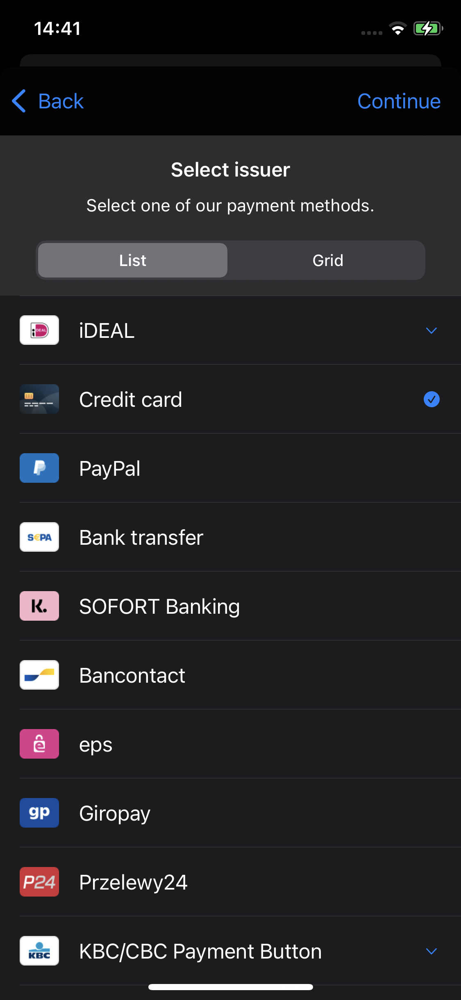
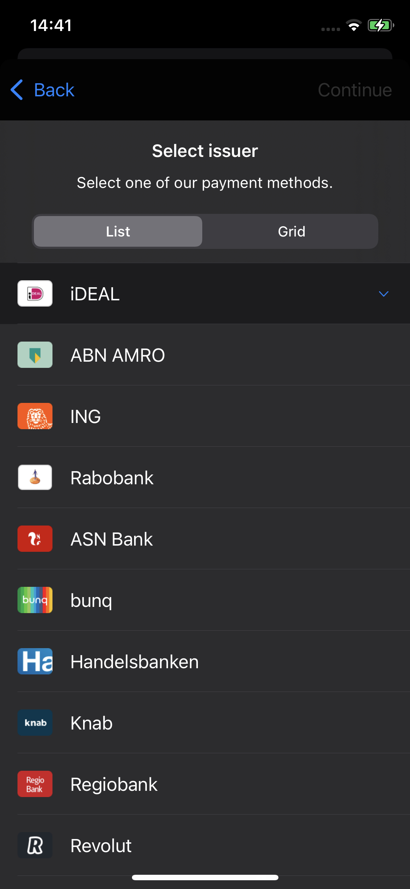
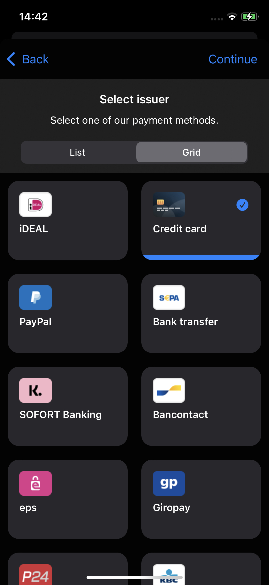

# Including payment method selection

When customers place an order in your app, they execute the payment in two steps:

1.  The customer selects the payment method, for example, iDEAL or credit card.
2.  The customer completes the payment using a native app or by providing requested details.

By default, Mollie handles both steps in the browser (external or in-app, depending on your chosen implementation). You can also add the payment method selection step to your app, so that it matches your app’s theme. In this case, customers select the payment method in your app and complete the payment through the browser.

| Web (default) | Native (optional) |
| ------------- | ----------------- |
| 
  
 | 
  
 |

## Implement method selection flows

Implementing the payment method selection step in your app is completely optional. There are three different flows depending on the payment method.

| Issuer selection | Single selection | Additional input |
| ---------------- | ---------------- | ---------------- |
| The payment method requires the customer to select an issuer. For example, iDEAL requires the customer to select a bank. To implement this flow, display the issuer list.   | The payment method doesn’t require additional input from the customer. For example, PayPal.   | The payment method requires the customer to provide additional information. For example, providing credit card details when paying by credit card.  To request the additional information in your app, create input forms for each of these method types and display them to the user. Create the payment using the additional input.  Mollie Checkout for iOS currently doesn’t demonstrate this flow. Instead, when a payment is created using this method, the app uses Mollie’s website to request the additional input. |

If you add the payment method selection step to your app, you should include the issuer and single selection flows. Including the additional input flow is optional.

> :warning: **Note**: The available payment methods can vary depending on the payment `amount`. You must therefore retrieve the payment methods from the backend, together with the `amount`.

## Display in a list or grid

In general, apps display payment methods (and issuers) in a list or a grid. The demo app provides both options so that you can decide which to implement, or leave it up to your customers to choose their preferred layout.

| List | List with issuers | Grid |
|------|-------------------|------|
|  |  |  |

## Example files

Open **Checkout** → **Scenes** → **CreatePayment** → **SelectPaymentMethod** to access the sample files, such as 
[SelectPaymentViewController.swift](Checkout/Scenes/CreatePayment/SelectPaymentMethod/SelectPaymentViewController.swift).
